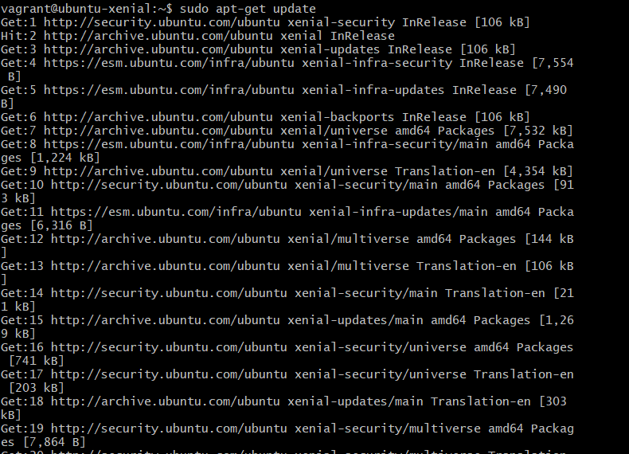
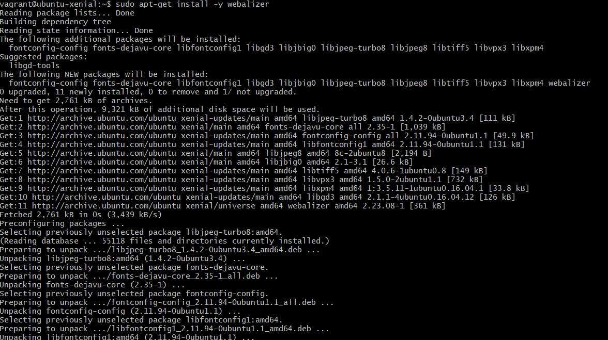
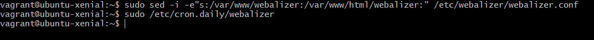
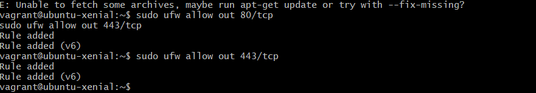
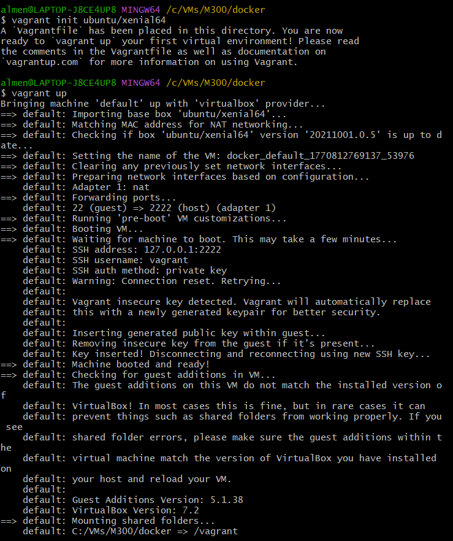
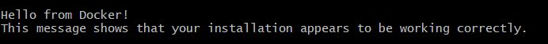
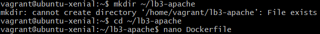
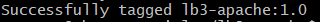
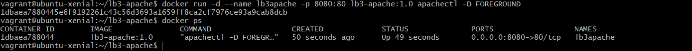
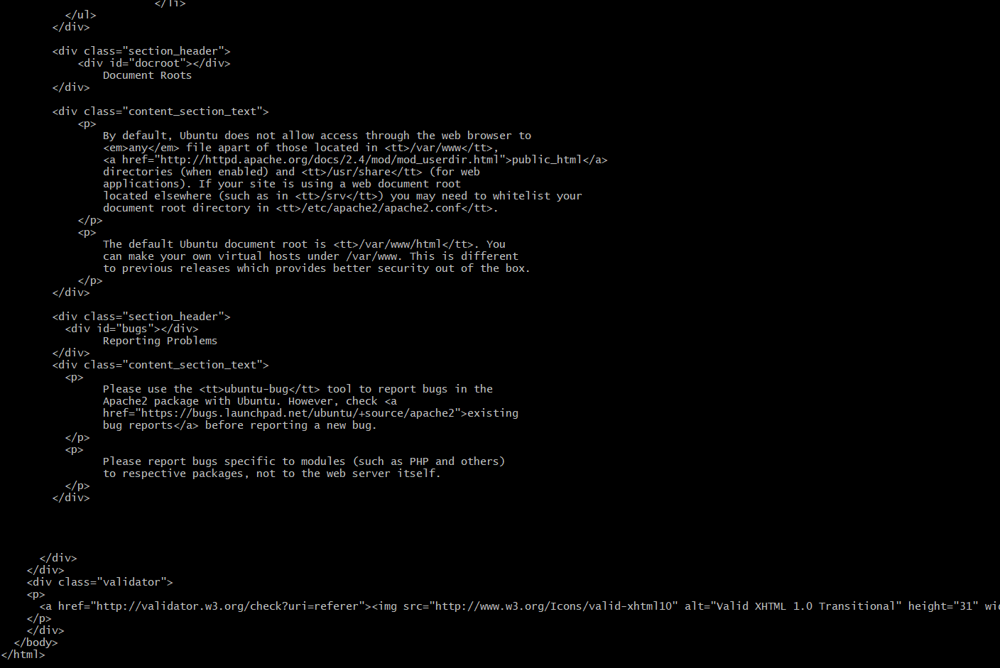

# M300 – Services & Cloud Computing

---

## Repository erstellen

1. Auf **www.github.com** anmelden  
2. Auf **Start a project** klicken  
3. Repository Name definieren (z.B. `M300-Services`)  
4. Optional Beschreibung eingeben  
5. **Public** auswählen  
6. Haken bei **Initialize with README** setzen  
7. **Create repository** klicken 


## SSH-Key erstellen (lokal)

```bash
$ ssh-keygen -t rsa -b 4096 -C "beispiel@beispiel.com"
Generating public/private rsa key pair.
Enter a file in which to save the key (~/.ssh/id_rsa): [Press enter]
Enter passphrase (empty for no passphrase): [Passwort]
Enter same passphrase again: [Passwort wiederholen]
```


## SSH-Key dem SSH-Agent hinzufügen

Public Key in die Zwischenablage kopieren:

```bash
$ cat ~/.ssh/id_rsa.pub
```

Den angezeigten Schlüssel komplett kopieren.

---

## SSH-Key bei GitHub hinzufügen

1. Auf **www.github.com** anmelden  
2. Oben rechts auf das Benutzerkonto klicken  
3. **Settings** öffnen  
4. Links auf **SSH and GPG keys** gehen  
5. Auf **New SSH key** klicken  
6. Unter **Title** eine Bezeichnung eingeben (z.B. `M300`)  
7. Den kopierten Key mit **CTRL + V** einfügen  
8. Auf **Add SSH key** klicken  

Der Schlüssel sollte nun in der Liste erscheinen.


## Client konfigurieren

Terminal (Bash) öffnen und Git mit den Informationen des GitHub-Accounts konfigurieren:

```bash
git config --global user.name "<username>"
git config --global user.email "<e-mail>"
```

Konfiguration abgeschlossen.

## Repository klonen (Test)

Zu Testzwecken soll ein Repository geklont werden.

Terminal (Bash) öffnen und folgende Befehle ausführen:

```bash
git clone https://gitlab.com/ch-tbz-it/Stud/m300/
cd M300
git pull
git status
```

Beispielausgabe:

```text
Already up to date.

Your branch is up to date with 'origin/master'.
```

Die Statusmeldung zeigt, dass das lokale Repository mit dem Original übereinstimmt.


## Repository herunterladen & aktualisieren (clone/pull)

Terminal (Bash) öffnen.

### Ordner für das Repository erstellen

```bash
cd Wohin/auch/immer
mkdir MeinLokalesRepository
cd MeinLokalesRepository
```

### Repository mit SSH klonen

```bash
git clone git@github.com:<IhrName>/my_M300.git
```

Beispielausgabe:

```text
Cloning into 'my_M300'...
```

### Repository aktualisieren und Status prüfen

```bash
git pull
```

Beispielausgabe:

```text
Already up to date.
```


# Cloud Computing

## Fragen

### Was versteht man unter Cloud Computing?
Darunter versteht man die Ausführung von Programmen, die nicht auf dem lokalen Rechner installiert sind, sondern auf einem entfernten Rechner laufen und über das Internet aufgerufen werden.

### Was versteht man unter Infrastructure as a Service (IaaS)?
IaaS stellt die unterste Schicht im Cloud Computing dar.  
Der Benutzer greift auf bestehende Infrastruktur wie virtuelle Maschinen, Speicher und Netzwerke zu und verwaltet das Betriebssystem selbst.

### Was ist der Unterschied zur manuellen Installation der VM?
- Automatisierung
- Wiederholbarkeit
- Dokumentation

---

## Vagrant

### Was wird mit Vagrant erzeugt?
Virtuelle Maschinen.

### Welche der Aussagen treffen zu?

a) Vagrant ist ein Hypervisor  
b) Vagrant erzeugt virtuelle Maschinen und unterstützt mehrere Hypervisor und Cloud-Umgebungen (z.B. AWS)  
c) Vagrant erzeugt Container  

**Antwort:**  
**b)**

### In welchen Bereich des Cloud-Computings ist Vagrant einzuordnen?
**IaaS**

### Welche Alternativen zu Vagrant bestehen?
https://alternativeto.net/software/vagrant/

### Wo speichert Vagrant seine Konfiguration?
Im **Vagrantfile**.

### Was bedeutet die Fehlermeldung  
"A Vagrant environment or target machine is required to run this command."?
Man befindet sich im falschen Verzeichnis, in dem kein **Vagrantfile** vorhanden ist.

### Bei welcher LPI-Zertifizierung nützt mir das Vagrant-Wissen?
[DevOps Tools Engineer](https://www.lpi.org/our-certifications/devops-overview)


  ## Cloud Computing

Cloud Computing bedeutet, dass Programme und Daten nicht auf dem eigenen Computer laufen, sondern auf Servern im Internet. Der Zugriff erfolgt über einen Browser oder eine App. Der Anbieter stellt Infrastruktur, Plattformen oder fertige Software bereit.

### Cloud-Modelle

- **IaaS (Infrastructure as a Service)**  
  Der Anbieter stellt virtuelle Server, Speicher und Netzwerk bereit.  
  Der Benutzer verwaltet Betriebssystem und Anwendungen selbst.

- **PaaS (Platform as a Service)**  
  Eine fertige Plattform wird bereitgestellt.  
  Der Entwickler lädt nur noch seine Anwendung hoch, alles andere übernimmt die Cloud.

- **SaaS (Software as a Service)**  
  Fertige Anwendungen über das Internet.  
  Keine Installation oder Wartung notwendig.

- **CaaS (Container as a Service)**  
  Anwendungen laufen in Containern auf der Cloud-Infrastruktur.  
  Beispiele: Docker, Kubernetes.

### Cloud-Arten
- **Public Cloud:** Dienste über das Internet
- **Private Cloud:** innerhalb eines Unternehmens
- **Lokale Virtualisierung:** auf einem einzelnen Rechner

### Vorteile der Cloud
- Schnelle Bereitstellung von Ressourcen
- Automatisierung
- Skalierbarkeit
- Weniger Hardware-Abhängigkeit

---

## Infrastructure as Code (IaC)

Infrastructure as Code bedeutet, dass IT-Infrastruktur über Code definiert und automatisch bereitgestellt wird.  
Statt manueller Einrichtung werden Konfigurationen in Dateien gespeichert und automatisiert ausgeführt.

### Vorteile von IaC
- Wiederholbare Systeme
- Automatisierung
- Schnellere Änderungen
- Einfachere Wiederherstellung

### Typische IaC-Toolarten
- Infrastructure Definition Tools
- Server Configuration Tools
- Package Management Tools
- Scripting Tools
- Versionsverwaltung


## Vagrant

Vagrant ist eine Open-Source-Anwendung zur Erstellung und Verwaltung von virtuellen Maschinen.  
Es verbindet Virtualisierungssoftware wie VirtualBox, VMware oder Hyper-V mit Konfigurations- und Automatisierungstools.

---

### Wichtige Befehle

```bash
vagrant init        # Vagrant-Umgebung erstellen
vagrant up          # VM starten und konfigurieren
vagrant ssh         # Verbindung zur VM herstellen
vagrant status      # Status anzeigen
vagrant port        # Weitergeleitete Ports anzeigen
vagrant halt        # VM stoppen
vagrant destroy     # VM löschen
```

---

### Boxen
Boxen sind vorkonfigurierte virtuelle Maschinen (Vorlagen).

Beispiele:

```bash
vagrant box add ubuntu/xenial64
vagrant box list
vagrant box remove <box-name>
```

---

### VM erstellen

```bash
mkdir myserver
cd myserver
vagrant init ubuntu/xenial64
vagrant up
```

Status anzeigen:

```bash
vagrant status
```

VM aktualisieren:

```bash
vagrant provision
```

VM löschen:

```bash
vagrant destroy -f
```

---

### Vagrantfile (Beispiel)

Die Konfiguration erfolgt im **Vagrantfile**:

```ruby
Vagrant.configure("2") do |config|
  config.vm.box = "bento/ubuntu-16.04"
  config.vm.hostname = "srv-web"
  config.vm.network :forwarded_port, guest: 80, host: 4567
end
```

---

### Provisioning (Beispiel)

Automatische Installation von Software:

```ruby
config.vm.provision :shell, inline: <<-SHELL
  sudo apt-get update
  sudo apt-get -y install apache2
SHELL
```

---

### Provider (Beispiel)

Festlegen der Virtualisierungsplattform:

```ruby
config.vm.provider "virtualbox" do |vb|
  vb.memory = "512"
end
```

---

### Synced Folders

Synchronisierte Ordner verbinden Host und VM:

```ruby
config.vm.synced_folder ".", "/var/www/html"
```

Damit kann z.B. das Webverzeichnis der VM direkt vom Host bearbeitet werden.


## Reflexion

Cloud Computing bedeutet, dass Programme und Daten auf entfernten Servern statt auf dem eigenen Computer laufen. Dadurch können Anwendungen von überall über das Internet genutzt werden.

Dynamische Infrastruktur-Plattformen stellen virtualisierte Ressourcen wie Rechenleistung, Speicher und Netzwerke bereit. Diese werden automatisch verwaltet und meist als virtuelle Maschinen zur Verfügung gestellt.

Damit **Infrastructure as Code (IaC)** eingesetzt werden kann, müssen folgende Voraussetzungen erfüllt sein:

- Infrastruktur ist über Schnittstellen programmierbar
- Ressourcen können schnell erstellt und gelöscht werden
- Nutzer können Systeme selbst verwalten
- Wechsel zwischen Anbietern ist möglich
- Sicherheitsstandards und Zertifizierungen sind gewährleistet


## LB2 – Hands-on

Zuerst habe ich **Git Bash** geöffnet, in mein Arbeitsverzeichnis gewechselt und mit folgenden Befehlen eine neue VM erstellt:

```bash
mkdir myvm
cd myvm
vagrant init
vagrant up
```


  Die VM hat sich während der Einrichtung aufgehängt und ich konnte nicht weiterarbeiten.  
Mit folgendem Befehl konnte das Problem behoben werden:

```bash
vagrant reload --provision
```


Danach war eine Verbindung per SSH wieder möglich:

```bash
vagrant ssh
```


 Anschliessend musste ich die Serverdienste installieren.  
Zuerst habe ich **Apache** installiert. Wichtig ist die Option `-y`, damit die Installation automatisch bestätigt wird:

```bash
sudo apt-get update
sudo apt-get -y install apache2
```



  Anschliessend habe ich den **Webalizer** installiert:

```bash
sudo apt-get -y install webalizer
```


  
  Danach habe ich den Befehlsverlauf angezeigt:

```bash
history
```


  ## Feintuning

Damit der **Webalizer** Daten auswerten kann, musste zuerst etwas Traffic erzeugt werden.  
Dazu habe ich folgende Befehle ausgeführt:

```bash
curl http://localhost
curl http://localhost
curl http://localhost
```


  Als Nächstes musste ich die **Access-Logs von Apache rotieren**, da der Webalizer nur Archivdaten auswerten kann:

```bash
sudo logrotate -f /etc/logrotate.d/apache2
```


  Danach habe ich das **Output-Verzeichnis korrigiert** und anschliessend eine Webalizer-Ausgabe erzeugt:

```bash
sudo webalizer
```


  Zum Schluss habe ich die Auswertung in der **Web-Ansicht** geöffnet:


## 25 – Sicherheit (Fragen)

### Was ist der Unterschied zwischen einem Webserver und einem Reverse Proxy?
Ein Webserver liefert HTML-Seiten direkt an den Benutzer.  
Ein Reverse Proxy steht davor und leitet die Anfragen an den eigentlichen Webserver weiter.

### Was versteht man unter einer White List?
Eine White List enthält vertrauenswürdige Elemente, während eine Black List unerwünschte Elemente sperrt.

### Was wäre die Alternative zum Absichern einzelner Server mit einer Firewall?
Eine **zentrale Firewall**.

### Was ist der Unterschied zwischen der Datei `id_rsa` und `id_rsa.pub`?
- `id_rsa` → Private Key  
- `id_rsa.pub` → Public Key  

### Wo darf ein SSH-Tunnel nicht angewendet werden?
Innerhalb der Firma (gemäss Sicherheitsrichtlinien).

### Wozu dient die Datei `authorized_keys`?
Sie enthält die öffentlichen Schlüssel der Benutzer, die sich ohne Passwort am System anmelden dürfen.

### Wozu dient die Datei `known_hosts`?
Sie speichert die öffentlichen Schlüssel von Servern, mit denen man sich per SSH verbunden hat.  
So kann das System prüfen, ob der Server derselbe ist wie beim letzten Verbindungsaufbau und vor Man-in-the-Middle-Angriffen warnen.

## 25 – Sicherheit (Umsetzung)

### Firewall & Reverse Proxy
Steht eine VM direkt im Internet, sind alle Dienste offen zugänglich und damit unsicher.  
Eine **Firewall** blockiert unerwünschte Verbindungen, während ein **Reverse Proxy** Anfragen weiterleitet, ohne die echte Serveradresse preiszugeben.

---

### UFW Firewall
UFW (Uncomplicated Firewall) ist ein einfaches Kommandozeilen-Tool zur Konfiguration der Linux-Firewall.  
Es dient als benutzerfreundliche Oberfläche für das komplexere System **iptables**.

### Installation und Aktivierung

```bash
sudo apt-get install ufw
sudo ufw enable
```
    
  
  


### SSH-Port freigeben

Damit ich mich später nicht selbst aussperre, musste der **SSH-Port** in der Firewall freigegeben werden:

```bash
sudo ufw allow ssh
```
  


### Firewall-Regeln konfigurieren

Anschliessend habe ich die **Firewall-Regeln überprüft und konfiguriert**:

```bash
sudo ufw status
```  
  


### Reverse Proxy

Hier habe ich **Apache als Reverse Proxy** installiert.

Zuerst mussten die benötigten Pakete installiert werden.  
Wichtig: Die entsprechenden Ports müssen vorher in der Firewall freigegeben werden, sonst kommt es zu einem Installationsfehler (ist mir passiert).

```bash
sudo apt-get install apache2
```



## 30 – Container (Fragen)

### Container allgemein

**Was ist der Unterschied zwischen Vagrant und Docker?**  
Vagrant erstellt virtuelle Maschinen (IaaS), Docker arbeitet mit Containern (CaaS/PaaS).

**Welches Docker-Tool ist mit Vagrant vergleichbar?**  
`docker machine`

**Was macht der Docker-Provisioner von Vagrant?**  
Er installiert Docker in einer VM.

**Welche Linux-Kernelfunktion nutzen Container?**  
Linux **Namespaces**.

**Welches Architekturmuster wird oft mit Containern verwendet?**  
**Microservices**

**Drei Hauptmerkmale von Microservices (nach Unix-Prinzip):**
- Ein Dienst = eine Aufgabe
- Dienste arbeiten zusammen
- Kommunikation über standardisierte Schnittstellen (z.B. REST)

---

### Docker

**Unterschied zwischen Image und Container?**  
- **Image:** Vorlage, schreibgeschützt  
- **Container:** laufende Instanz eines Images

**Unterschied VM und Docker-Container?**  
- VM: eigenes Betriebssystem  
- Container: nur Anwendung und Prozesse

**Wie bekomme ich Infos zu einem laufenden Container?**
```bash
docker logs
docker inspect
```

**Unterschied Registry und Repository?**  
- **Registry:** Speicherort für Images (z.B. Docker Hub)  
- **Repository:** Sammlung von Versionen eines Images

**Wie erstelle ich ein Image?**
```bash
docker build
```

**In welcher Datei steht die Image-Konfiguration?**  
`Dockerfile`

**Welche Prozessnummer hat der erste Prozess im Container?**  
**1**

**Welche Aussage ist besser (siehe auch The Twelve-Factor App)?**

a) Dockerfile sollten möglichst das Builden (CI) und Ausführen von Services beinhalten, so ist alles an einem Ort und der Entwickler kann alles erledigen.  
b) Das Builden und Ausführen von Services ist strikt zu trennen. Damit saubere und nachvollziehbare Services mittels CI/CD-Prozess entstehen.

**Antwort:**  
b) 

---

### Docker Hub

**Was ist Docker Hub?**  
Eine öffentliche **Container-Registry** für Docker Images.

**Alternativen zu Docker Hub?**  
- Cloud-Registries (AWS, Azure, GCP)
- Private Registries
- Tools wie Nexus

**Warum eigene Registry im Unternehmen?**  
Mehr Sicherheit und Kontrolle über Images.

**Warum immer Versions-Tags verwenden?**  
Sonst wird automatisch `latest` genutzt und die Version ist unklar.

**Unterschied zwischen `save/load` und `export/import`?**
- `save/load` → für Images
- `export/import` → für Container


## Container

Container verändern die Art, wie Software entwickelt, verteilt und betrieben wird.

Entwickler können Anwendungen lokal bauen, die später überall gleich laufen,
zum Beispiel auf Servern im Unternehmen, auf Laptops oder in der Cloud.

Administratoren müssen sich weniger um Abhängigkeiten und Konfigurationen kümmern und können sich stärker auf Netzwerke, Ressourcen und Verfügbarkeit konzentrieren.

---

### Merkmale von Containern

- Teilen sich Ressourcen mit dem Host-Betriebssystem
- Starten und stoppen in Sekundenbruchteilen
- Sehr geringer Overhead
- Hohe Portabilität („Läuft überall gleich“)
- Leichtgewichtig – viele Container parallel möglich
- Optimal für Cloud-Umgebungen geeignet


## Geschichte der Container

Container sind kein neues Konzept. Die Idee der Isolation von Prozessen und Dateisystemen existiert schon seit Jahrzehnten.

### Wichtige Meilensteine

- **1979 – chroot (UNIX)**  
  Erste einfache Form der Dateisystem-Isolation.

- **1998 – FreeBSD Jails**  
  Erweiterung von chroot mit Prozess-Isolation.

- **2001 – Solaris Zones**  
  Erste weitgehend vollständige Container-Technologie (nur für Solaris).

- **2001 – Virtuozzo (Parallels)**  
  Kommerzielle Containerlösung für Linux.  
  Später als Open Source unter **OpenVZ** veröffentlicht.

- **2006–2008 – Google & Linux**  
  Entwicklung von **cgroups** zur Ressourcenverwaltung.  
  Start des **LXC-Projekts** (Linux Containers), das Namespaces und cgroups kombiniert.

- **2013 – Docker**  
  Macht Container einfach nutzbar und bringt die Technologie in den Mainstream.

Weitere Infos:  
*The Missing Introduction To Containerization*


## Microservices

Microservices sind einer der wichtigsten Gründe für den Einsatz von Containern.

Dabei wird ein Softwaresystem in **kleine, unabhängige Dienste** aufgeteilt, die über das Netzwerk miteinander kommunizieren.  
Das ist das Gegenteil eines **monolithischen Systems**, bei dem alles in einem einzigen grossen Programm steckt.

### Skalierung

- **Monolith:** meist nur vertikale Skalierung (mehr RAM, mehr CPU)
- **Microservices:** horizontale Skalierung (mehrere Instanzen auf verschiedenen Rechnern)

Vorteil:  
Nur die Dienste, die viel Last haben, müssen skaliert werden.  
Dadurch werden Ressourcen effizienter genutzt.

---

## Docker

Docker nutzt bestehende Linux-Containertechnologien und macht sie durch **portable Images** und eine einfache Bedienung leicht nutzbar.

Die Plattform besteht aus zwei Hauptkomponenten:

- **Docker Engine:** erstellt und startet Container
- **Docker Hub:** Online-Registry für Container-Images

Hinweis:  
Docker wurde für 64-Bit-Linux entwickelt, kann aber über Virtualisierung auch auf Windows und macOS genutzt werden.

---

## Docker Architektur

### Docker Daemon
- Erstellt, startet und überwacht Container
- Baut und speichert Images
- Läuft im Hintergrund auf dem Host-System

### Docker Client
- Bedienung über die Kommandozeile (CLI)
- Kommuniziert per HTTP mit dem Docker Daemon
- Kann auch entfernte Docker-Systeme steuern

---

### Images
- Vorlage für Container
- Nicht veränderbar (read-only)
- Bestehen aus Name und Version, z.B. `ubuntu:22.04`
- Ohne Angabe wird automatisch `:latest` verwendet

### Container
- Laufende Instanz eines Images
- Können mehrfach gestartet werden
- Speichern nur Änderungen gegenüber dem Image

### Docker Registry
- Speicherort für Images
- Standard: **Docker Hub**
- Firmen nutzen oft eigene Registries für private Images


## Docker Befehle

Der Docker Client stellt viele Befehle zur Verfügung.  
Der wichtigste davon ist `docker run`, mit dem Container gestartet werden.

### docker run
Startet einen neuen Container aus einem Image.  
Mit verschiedenen Optionen kann festgelegt werden, wie der Container läuft.

---

### Beispiele

**Testcontainer starten:**
```bash
docker run hello-world
```

**Container mit interaktiver Shell starten:**
```bash
docker run -it ubuntu /bin/bash
```

**Container im Hintergrund starten:**
```bash
docker run -d ubuntu sleep 20
```

**Container im Hintergrund starten und nach Beendigung löschen:**
```bash
docker run -d --rm ubuntu sleep 20
```

**Container starten und Datei erstellen:**
```bash
docker run -d ubuntu touch /tmp/lock
```

**Container starten und Root-Verzeichnis anzeigen:**
```bash
docker run -d ubuntu ls -l /
```

### Container anzeigen

**Aktive Container anzeigen:**
```bash
docker ps
```

**Alle Container anzeigen (auch gestoppte):**
```bash
docker ps -a
```

**Nur Container-IDs anzeigen:**
```bash
docker ps -a -q
```

---

### Images anzeigen

**Lokale Images auflisten:**
```bash
docker images
```

Alternative:
```bash
docker image ls
```

---

### Container und Images löschen

**Container löschen:**
```bash
docker rm <name>
```

**Alle gestoppten Container löschen:**
```bash
docker rm $(docker ps -a -q)
```

**Alle Container löschen (auch aktive):**
```bash
docker rm -f $(docker ps -a -q)
```

**Image löschen:**
```bash
docker rmi ubuntu
```

**Unbenutzte Zwischenimages löschen:**
```bash
docker rmi $(docker images -q -f dangling=true)
```

---

### Container starten und stoppen

**Gestoppten Container starten:**
```bash
docker start <id>
```

**Container stoppen:**
```bash
docker stop <id>
```

**Container sofort beenden (kill):**
```bash
docker kill <id>
```

---

### Informationen zu Containern

**Logs anzeigen:**
```bash
docker logs <id>
```

**Detailinformationen anzeigen:**
```bash
docker inspect <id>
```

**Änderungen im Container-Dateisystem anzeigen:**
```bash
docker diff <id>
```

**Laufende Prozesse im Container anzeigen:**
```bash
docker top <id>
```


## Dockerfile

Ein **Dockerfile** ist eine Textdatei mit Anweisungen, um ein Docker-Image automatisch zu erstellen.

Zuerst wird ein Verzeichnis erstellt und darin eine Datei mit dem Namen **Dockerfile** angelegt.

---

### Image bauen

```bash
docker build -t mysql .
```

---

### Container starten

```bash
docker run --rm -d --name mysql mysql
```

---

### Funktionsfähigkeit prüfen

In den Container wechseln:

```bash
docker exec -it mysql bash
```

Prozesse und offene Ports überprüfen:

```bash
ps -ef
netstat -tulpen
```

## Docker Konzepte

### Build Context
Der Befehl `docker build` benötigt:

- ein **Dockerfile**
- einen **Build Context**

Der Build Context ist der Ordner mit allen Dateien, auf die im Dockerfile über `ADD` oder `COPY` zugegriffen wird.

---

### Layer (Imageschichten)
Jede Anweisung im Dockerfile erzeugt eine neue **Imageschicht (Layer)**.

Ablauf:
1. Container aus vorherigem Layer starten
2. Dockerfile-Anweisung ausführen
3. Neues Image speichern
4. Temporären Container löschen

Diese Schichten können wiederverwendet werden und beschleunigen Builds.

---

### Wichtige Dockerfile-Anweisungen

| Anweisung | Funktion |
|-----------|----------|
| `FROM` | Basis-Image festlegen (z.B. `ubuntu:22.04`) |
| `RUN` | Befehl im Container ausführen |
| `COPY` | Dateien aus Build Context ins Image kopieren |
| `ADD` | Dateien oder URLs ins Image kopieren |
| `CMD` | Standardbefehl beim Start des Containers |
| `ENTRYPOINT` | Hauptprozess des Containers |
| `ENV` | Umgebungsvariablen setzen |
| `WORKDIR` | Arbeitsverzeichnis festlegen |
| `USER` | Benutzer für folgende Befehle festlegen |
| `EXPOSE` | Port deklarieren |
| `VOLUME` | Verzeichnis als Volume definieren |
| `HEALTHCHECK` | Zustand des Containers prüfen |

Beispiel für Healthcheck:

```dockerfile
HEALTHCHECK --interval=5m --timeout=3s \
  CMD curl -f http://localhost/ || exit 1
```

## Netzwerk-Anbindung von Containern

Wenn ein Dienst (z.B. ein Webserver oder eine Datenbank) in einem Container läuft, muss der entsprechende **Port veröffentlicht** werden, damit er von aussen erreichbar ist.

Dies geschieht mit den Optionen `-p` oder `-P` beim Starten des Containers.

---

### Ports veröffentlichen

**MySQL-Container an festen Host-Port 3306 binden:**
```bash
docker run --rm -d -p 3306:3306 mysql
```

**MySQL-Container an einen freien Host-Port binden:**
```bash
docker run --rm -d -P mysql
```

---

### Port im Dockerfile freigeben

Damit ein Container einen Port nutzt, kann dieser im Dockerfile angegeben werden:

```dockerfile
EXPOSE 3306
```

---

### Zugriff vom Host auf MySQL im Container

**1. MySQL-Client auf dem Host installieren:**
```bash
sudo apt-get install mysql-client
```

**2. Port in der MySQL-Konfiguration freigeben (im Dockerfile):**
```dockerfile
RUN sed -i -e "s/^bind-address\s*=\s*127.0.0.1/bind-address = 0.0.0.0/" /etc/mysql/my.cnf
```

**3. Zugriff in MySQL erlauben:**
```sql
CREATE USER 'root'@'%' IDENTIFIED BY 'admin';
GRANT ALL PRIVILEGES ON *.* TO 'root'@'%';
FLUSH PRIVILEGES;
```

**4. Verbindung vom Host herstellen:**
```bash
mysql -u root -p admin -h 127.0.0.1
```

## Container-Networking

Bei Docker können Netzwerke unabhängig von Containern erstellt und verwaltet werden.  
Container im gleichen Netzwerk können direkt miteinander kommunizieren.

---

### Standard-Netzwerke

| Netzwerk | Beschreibung |
|----------|-------------|
| `bridge` | Standardnetzwerk, Ports können nach aussen gemappt werden |
| `none` | Container ohne Netzwerkschnittstelle |
| `host` | Container nutzt direkt das Host-Netzwerk |

---

### Wichtige Befehle

**Vorhandene Netzwerke anzeigen:**
```bash
docker network ls
```

**Details zu einem Netzwerk anzeigen:**
```bash
docker network inspect bridge
```

---

### Container ohne Netzwerk starten

```bash
docker run --network=none -it --name c1 --rm busybox
```

Im Container prüfen:
```bash
ifconfig
```

---

### Container mit Host-Netzwerk starten

```bash
docker run --network=host -itd --name c1 --rm busybox
```

---

### Eigenes Bridge-Netzwerk erstellen

```bash
docker network create --driver bridge isolated_nw
```

Container im neuen Netzwerk starten:

```bash
docker run --rm -d --network=isolated_nw --name mysql mysql
docker run -it --rm --network=isolated_nw --name ubuntu ubuntu:14.04 bash
```

Im Ubuntu-Container Verbindung testen:

```bash
apt-get update && apt-get install -y curl
curl -f http://mysql:3306
```

---

### Container-Linking (veraltet)

Früher konnten Container direkt verlinkt werden:

```bash
docker run -it --rm --link mysql:mysql ubuntu:14.04 bash
```

Heute wird stattdessen ein gemeinsames Docker-Netzwerk verwendet.

## 04 – Volumes

Standardmässig gehen alle Änderungen im Dateisystem verloren, wenn ein Docker-Container gelöscht wird.

Um Daten zu speichern, bietet Docker mehrere Möglichkeiten:

- Daten direkt auf dem Host speichern
- Daten zwischen Containern teilen
- Eigene **Volumes** für persistente Daten verwenden

---

### Volume im Dockerfile definieren

Damit Daten dauerhaft gespeichert werden, kann ein Verzeichnis als Volume definiert werden:

```dockerfile
VOLUME /var/lib/mysql
```

Beispiel:  
Das MySQL-Datenverzeichnis wird als Volume gespeichert und bleibt auch nach dem Löschen des Containers erhalten.


## Volumes (Details)

Volumes sind spezielle Verzeichnisse auf dem Host, in denen Container ihre Daten persistent speichern können.

### Eigenschaften von Volumes

- Werden beim Erstellen eines Containers initialisiert
- Können zwischen Containern geteilt werden
- Änderungen erfolgen direkt im Volume
- Bleiben bestehen, auch wenn der Container gelöscht wird
- Sind unabhängig vom Lebenszyklus des Containers
- Werden von Docker **nicht automatisch gelöscht**

---

### Beispiel: Volume im Container erstellen

```bash
docker run --network=host -it --name c2 -v /data --rm busybox
```

Im Container:

```bash
cd /data
mkdir t1
echo "Test" > t1/test.txt
```

Volume-Informationen anzeigen:

```bash
docker inspect c2
```

Datei auf dem Host anzeigen:

```bash
sudo cat /var/lib/docker/volumes/<volume-id>/_data/t1/test.txt
```

---

### Beispiel: Host-Verzeichnis als Volume einbinden

```bash
docker run -d -p 3306:3306 \
  -v ~/data/mysql:/var/lib/mysql \
  --name mysql --rm mysql
```

Daten auf dem Host prüfen:

```bash
ls -l ~/data/mysql
```

---

### Beispiel: Einzelne Datei einbinden

```bash
docker run --rm -it \
  -v ~/.bash_history:/root/.bash_history \
  ubuntu /bin/bash
```

## Datencontainer (veraltet)

Früher wurden sogenannte **Datencontainer** verwendet, um Daten zwischen mehreren Containern zu teilen.  
Diese Container dienten nur als Speicher und wurden von anderen Containern eingebunden.

Heute werden stattdessen **Docker Volumes** verwendet, da sie flexibler und einfacher zu verwalten sind.

---

### Beispiel: Datencontainer erstellen

```bash
docker create -v /dbdata --name dbstore busybox
```

### Zweiten Container mit Datencontainer starten

```bash
docker run -it --volumes-from dbstore --name db busybox
```

Im Container prüfen:

```bash
ls -l /dbdata
```

Das Verzeichnis `/dbdata` stammt vom Datencontainer und ist im zweiten Container eingebunden.

## Named Volumes

Seit Docker Version 1.9 können Volumes direkt über den Befehl `docker volume` verwaltet werden.

**Vorteile von Named Volumes:**
- Zentrale Verwaltung über Docker
- Können von mehreren Containern genutzt werden
- Kein separater Datencontainer nötig
- Unabhängig vom Container-Lebenszyklus

---

### Beispiele

**Volume erstellen:**
```bash
docker volume create mysql
```

**Vorhandene Volumes anzeigen:**
```bash
docker volume ls
```

**Container starten und Volume einbinden:**
```bash
docker run -it --name c2 -v mysql:/var/lib/mysql --rm busybox
```

---

### Volume im Dockerfile definieren

```dockerfile
VOLUME /var/lib/mysql
```

## 05 – Image-Bereitstellung

Eigene Docker-Images können für andere bereitgestellt werden, z.B.:

- für Kollegen
- für CI/CD-Server
- für Endanwender

Images können auf verschiedene Arten verteilt werden:

- Neu bauen aus einem Dockerfile
- Aus einer Registry laden (`docker pull`)
- Aus einer Archivdatei laden (`docker load`)

---

### Namensgebung von Images

Ein Image besteht aus **Name und Version (Tag)**, z.B.:

```text
ubuntu:22.04
```

Wird kein Tag angegeben, verwendet Docker automatisch:

```text
:latest
```

---

### Images bauen und taggen

```bash
docker build -t mysql .
docker build -t mysql:1.0 .
docker tag mysql username/mysql
```

---

### Regeln für Tags

- Erlaubt: Buchstaben, Zahlen, `.` und `-`
- Maximal 128 Zeichen
- Darf nicht mit `.` oder `-` beginnen

Ein klares Namensschema ist wichtig für einen sauberen Entwicklungs-Workflow.

---

### Achtung beim `latest`-Tag

- `latest` ist nur ein Standardwert ohne besondere Bedeutung
- Wird kein Tag angegeben, nutzt Docker automatisch `latest`
- Es ist besser, immer eine **genaue Versionsnummer** zu verwenden


## Docker Hub

Die einfachste Möglichkeit, eigene Docker-Images bereitzustellen, ist der **Docker Hub**.  
Dabei handelt es sich um eine öffentliche Online-Registry von Docker.

- Öffentliche Repositories sind kostenlos
- Private Repositories sind kostenpflichtig

---

### Docker Hub einrichten

1. Account auf **Docker Hub** erstellen  
2. Image mit dem Benutzernamen taggen:

```bash
docker tag mysql username/mysql
```

3. Image hochladen:

```bash
docker push username/mysql
```

4. Image im Docker-Hub-Dashboard beschreiben

---

### Weitere Befehle

**Nach Images suchen:**
```bash
docker search mysql
```

**Image herunterladen:**
```bash
docker pull ubuntu
```
## Export und Import von Containern und Images

Um Container oder Images zwischen verschiedenen Hosts zu übertragen, wird keine Registry benötigt.  
Stattdessen können sie als **Archivdateien** exportiert und importiert werden.

---

### Container exportieren und importieren

**Laufende Container anzeigen:**
```bash
docker ps
```

**Container exportieren:**
```bash
docker export vagrant_apache_1 -o va1.tar
```

**Container auf anderem Host importieren (als Image):**
```bash
docker import va1.tar va1
```

**Importiertes Image anzeigen:**
```bash
docker images
```

---

### Images exportieren und importieren

**Lokale Images anzeigen:**
```bash
docker images
```

**Image als TAR-Datei speichern:**
```bash
docker save mysql -o mysql.tar
docker save apache -o apache.tar
```

**Image wieder laden:**
```bash
docker load -i mysql.tar
```

## Private Registry

Neben dem Docker Hub gibt es auch die Möglichkeit, eine **eigene Registry** zu betreiben.

Alternativen wie:
- Images immer neu aus Dockerfiles bauen
- Images per Export/Import übertragen

sind unpraktisch, da sie langsam oder fehleranfällig sind.

Eine **private Registry** ermöglicht eine zentrale und zuverlässige Verwaltung von Images.

---

### Private Docker Registry starten

Registry-Image herunterladen:

```bash
docker pull registry:2
```

Registry-Container starten:

```bash
docker run -d -p 5000:5000 --restart=always --name registry \
  -v /var/spool/docker-registry:/var/lib/registry registry:2
```

---

### Docker-Client auf lokale Registry einstellen

Standardmässig nutzt Docker den Docker Hub.  
Damit der Client mit der lokalen Registry arbeitet, muss die Datei  
`/etc/docker/daemon.json` angepasst werden:

```json
{
  "insecure-registries": ["<server-ip>:5000"]
}
```

Danach Docker neu starten:

```bash
sudo systemctl restart docker
```

---

### Images von der lokalen Registry nutzen

**Image herunterladen:**
```bash
docker pull <server-ip>:5000/ubuntu
```

**Image hochladen:**
```bash
docker tag ubuntu <server-ip>:5000/myubuntu
docker push <server-ip>:5000/myubuntu
```

> `<server-ip>` durch die Adresse des Registry-Servers ersetzen.


## LB3 – Hands-on

### VM erstellen

Zuerst bin ich in **Git Bash** in das entsprechende Verzeichnis gewechselt und habe dort eine neue virtuelle Maschine erstellt.

```bash
cd /c/VMs/M300/docker
vagrant init ubuntu/xenial64
vagrant up
vagrant ssh
```


### Docker installieren

Danach musste ich **Docker.io** in der virtuellen Maschine installieren, da ohne Docker nicht weitergearbeitet werden kann.  
Die Installation erfolgte mit folgendem Befehl:

```bash
sudo apt-get -y install docker.io
```


### Docker-Berechtigungsproblem lösen

Beim Testen der Docker-Verbindung mit folgendem Befehl:

```bash
docker run hello-world
```

erschien die Fehlermeldung:

```
permission denied while trying to connect to the Docker daemon socket
```

Das Problem entstand, weil der Benutzer **vagrant** noch keine Berechtigung hatte, Docker zu verwenden.  
Zur Lösung habe ich die folgenden Befehle der Reihe nach ausgeführt:

```bash
sudo usermod -aG docker vagrant
exit
```

Danach auf dem Host-System:

```bash
vagrant reload
vagrant ssh
docker run hello-world
```

Anschliessend funktionierte der Docker-Test erfolgreich.

  

### Dockerfile erstellen

Daraufhin habe ich das **Dockerfile** mit folgenden Befehlen erstellt:

```bash
mkdir ~/lb3-apache
cd ~/lb3-apache
nano Dockerfile
```



### Docker-Image bauen

Danach habe ich das Docker-Image mit folgendem Befehl erstellt:

```bash
docker build -t lb3-apache:1.0 .
```

Der Build-Vorgang hat etwas gedauert, lief aber ohne Fehler durch und das Image wurde erfolgreich erstellt.



### Container starten und testen

Im nächsten Schritt habe ich geprüft, ob der Container korrekt läuft.  
Dazu habe ich ihn mit folgendem Befehl gestartet:

```bash
docker run -d --name lb3apache -p 8080:80 lb3-apache:1.0 apachectl -D FOREGROUND
```

Anschliessend habe ich den Status des Containers überprüft:

```bash
docker ps
```

Der Container lief korrekt und beim Test erhielt ich eine HTML-Ausgabe, was zeigt, dass der Webserver erfolgreich funktioniert.





### Ghost auf alternativen Port starten

Damit ich **Ghost** starten und mit **MySQL** verbinden konnte (Frontend), musste ich ihn auf **Port 8081** starten, da **Port 8080 bereits durch den Apache-Container belegt** war.

Zuerst habe ich den halb erstellten Ghost-Container entfernt:

```bash
docker rm -f ghost
```

Danach habe ich Ghost mit folgendem Befehl auf Port **8081** gestartet und mit der MySQL-Datenbank verbunden:

```bash
docker run -d --name ghost \
  -p 8081:2368 \
  --link ghost_mysql:mysql \
  -e database__client=mysql \
  -e database__connection__host=mysql \
  -e database__connection__user=ghost \
  -e database__connection__password=secret \
  -e database__connection__database=ghost \
  ghost:1-alpine
```


