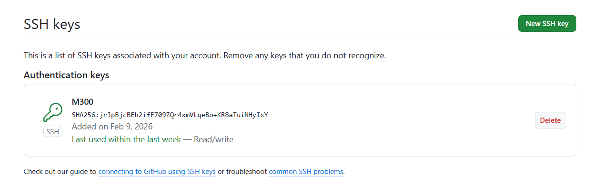
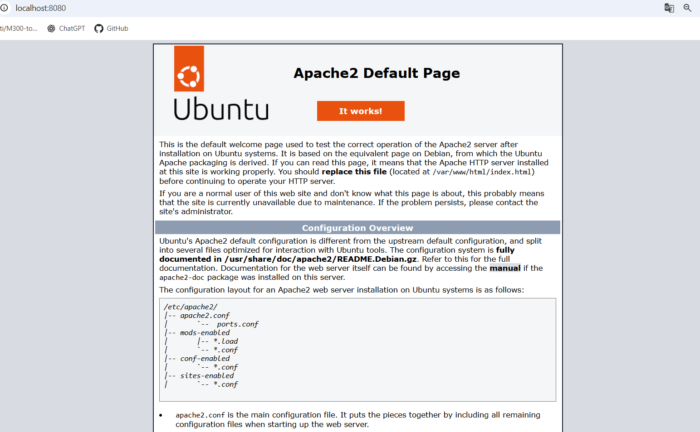
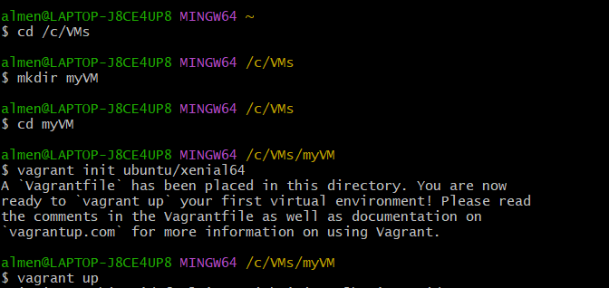
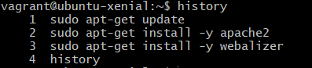
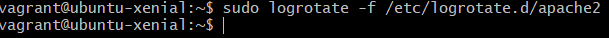
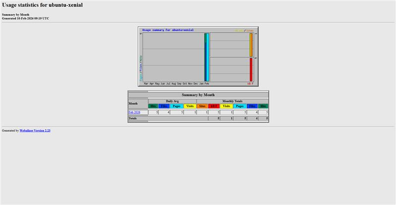

Repository erstellen:
Anmelden unter www.github.com
Innerhalb der Willkommens-Seite auf Start a project klicken
Unter Repository name einen Name definieren (z.B. M300-Services)
Optional: kurze Beschreibung eingeben
Radio-Button bei Public belassen
Haken bei Initialize this repository with a README setzen
Auf Create repository klicken

SSH-Key erstellen (lokal):
  $  ssh-keygen -t rsa -b 4096 -C "beispiel@beispiel.com"
    Generating public/private rsa key pair.
    Enter a file in which to save the key (~/.ssh/id_rsa): [Press enter]
    Enter passphrase (empty for no passphrase): [Passwort]
    Enter same passphrase again: [Passwort wiederholen]

SSH-Key dem SSH-Agent hinzufügen:
$HOME/.ssh/id_rsa.pub in Zwischenablage kopieren

SSH-Key hinzufügen:
Anmelden unter www.github.com
Auf Benutzerkonto klicken (oben rechts) und den Punkt Settings aufrufen
Unter den Menübereichen auf der linken Seite zum Abschnitt SSH und GPG keys wechseln
Auf New SSH key klicken
Im Formular unter Title eine Bezeichnung vergeben (z.B. MB SSH-Key)
Den zuvor kopierten Key mit CTRL + V einfügen und auf Add SSH key klicken
Der Schlüssel (SSH-Key) sollte nun in der übergeordneten Liste auftauchen

Client konfigurieren:
Terminal (Bash) öffnen
Git konfigurieren mit Informationen des GitHub-Accounts:
  $ git config --global user.name "<username>"
  $ git config --global user.email "<e-mail>"
Konfiguration abgeschlossen

Repository klonen:
Zu Testzwecken soll ein Repository geklont werden. Dazu sind folgende Befehle notwendig:
Terminal (Bash) öffnen
Repository klonen:
  $ git clone https://gitlab.com/ch-tbz-it/Stud/m300/
In das M300-Verzeichnis wechseln:
  $ cd M300
Repository aktualisieren und Status anzeigen:
  $ git pull

  Already up to date.

  $ git status

  Your branch is up to date with 'origin/master'.
Die Statusmeldung soll dabei mitteilen, dass das lokale Repository mit dem Originalen übereinstimmt.

Repository herunterladen & aktualisieren (clone/pull):
Terminal (Bash) öffnen
Ordner für Repository im gewünschten Verzeichnis erstellen:
  $ cd Wohin/auch/immer
  $ mkdir MeinLokalesRepository
Repository mit SSH klonen (siehe Webseite des Repositorys unter "Clone or download"):
  $ git clone git@github.com:<Ihr Name>/my_M300.git

  Cloning into 'my_M300'...
Repository aktualisieren und Status anzeigen:
  $ git pull

  Already up to date.

Cloud Computing:
Was versteht man unter Cloud-Computing?
Darunter versteht man die Ausführung von Programmen, die nicht auf dem lokalen Rechner installiert sind, sondern auf einem anderen Rechner, der aus der Ferne aufgerufen wird (bspw. über das Internet).

Was versteht man unter Infrastructure as a Service - IaaS?
Die Infrastruktur stellt die unterste Schicht im Cloud Computing dar. Der Benutzer greift hier auf bestehende Dienste innerhalb des Systems zu, verwaltet seine Recheninstanzen (virtuelle Maschinen) allerdings weitestgehend selbst.

Was ist der Unterschied zur manuellen Installation der VM?
Automation, Wiederholbarkeit, Dokumentation

Was wird mit Vagrant erzeugt?
Virtuelle Maschinen

Welche der Aussagen treffen zu:

a. Vagrant ist ein HyperVisor
b. Vagrant erzeugt virtuelle Maschinen, dabei werden mehrere HyperVisor und Cloud Umgebungen (z.B. AWS) unterstützt.
c. Vagrant erzeugt Container
Antwort
 b.

In welchen Bereich des Cloud-Computings ist Vagrant einzuordnen: IaaS, PaaS, SaaS?
IaaS

Welche Alternativen zu Vagrant bestehen?
 https://alternativeto.net/software/vagrant/

Wo Speichert Vagrant seine Konfiguration?
Vagrantfile

Was bedeutet die Fehlermeldung "A Vagrant environment or target machine is required to run this command."?
Sie befinden im falschen Verzeichnis, wo keine Vagrantfile vorhanden ist.

Bei welcher LPI Zertifizierung nützt mir das Vagrant Wissen?
 [DevOps Tools Engineer](https://www.lpi.org/our-certifications/devops-overview)

    Cloud Computing bedeutet, dass Programme und Daten nicht auf dem eigenen Computer installiert oder gespeichert sind, sondern auf Servern im Internet laufen. Man greift über einen Browser oder eine App darauf zu, ohne selbst etwas installieren oder warten zu müssen. Der Anbieter stellt die nötige Infrastruktur, Plattformen oder fertige Software über das Internet bereit. Diese Cloud-Dienste werden in die drei Modelle IaaS, PaaS und SaaS eingeteilt.

    Beim Cloud Computing gibt es verschiedene Arten von Diensten:
    - Bei IaaS (Infrastructure as a Service) stellt der Anbieter nur die grundlegende Infrastruktur wie virtuelle Server, Speicher und Netzwerk bereit. Der Benutzer verwaltet seine virtuellen Maschinen und das Betriebssystem selbst.

    - Bei PaaS (Platform as a Service) stellt die Cloud bereits eine fertige Plattform zur Verfügung. Der Entwickler lädt nur noch seine Anwendung hoch, während sich die Cloud automatisch um Server, Betriebssystem und Verteilung der Ressourcen kümmert.

    - Bei SaaS (Software as a Service) nutzt der Benutzer eine fertige Anwendung über das Internet. Er muss nichts installieren, keine Server verwalten und sich nicht um Speicherung oder Skalierung kümmern.

    Zwischen IaaS und PaaS gibt es zusätzlich CaaS (Container as a Service). Dabei werden Anwendungen in Containern ausgeführt, die auf der Infrastruktur der Cloud laufen. Technologien wie Docker oder Kubernetes sorgen dafür, dass diese Container effizient gestartet, verteilt und verwaltet werden können.

    Microsoft Azure basiert auf einer dynamischen Infrastruktur-Plattform. Das bedeutet, dass Rechenleistung, Speicher und Netzwerke virtualisiert und bei Bedarf bereitgestellt werden, meist in Form von virtuellen Maschinen. So können Server schnell erstellt, angepasst oder wieder gelöscht werden.

    Solche Plattformen gibt es als Public Cloud über das Internet, als Private Cloud innerhalb eines Unternehmens oder als lokale Virtualisierung auf einem einzelnen Rechner. Wichtig ist, dass die Infrastruktur programmierbar ist, Ressourcen bei Bedarf erstellt werden können, Nutzer sie selbst verwalten können und Sicherheit sowie Zertifizierungen gewährleistet sind.

    Früher waren IT-Systeme fest an physische Hardware gebunden. Die Einrichtung und Wartung erfolgte manuell und benötigte viel Zeit und Aufwand. Änderungen an der Infrastruktur waren kompliziert und teuer.
    Heute im Cloud-Zeitalter sind Systeme virtualisiert und nicht mehr direkt an Hardware gebunden. Die Bereitstellung und Wartung erfolgen automatisiert über Software. Dadurch lassen sich Änderungen sehr schnell umsetzen, oft in wenigen Minuten oder Sekunden, was Unternehmen einen schnelleren Marktzugang ermöglicht.

    Infrastructure as Code (IaC) ist eine Methode, bei der IT-Infrastruktur automatisch über Code verwaltet und bereitgestellt wird. Anstatt Systeme manuell einzurichten, werden alle Einstellungen und Konfigurationen in Dateien definiert, überprüft und automatisch ausgeführt. Dadurch entstehen konsistente und wiederholbare Systeme.

    IaC nutzt bewährte Methoden aus der Softwareentwicklung, wie Versionsverwaltung, testgetriebene Entwicklung sowie kontinuierliche Integration und Auslieferung, um Änderungen sicher und automatisiert umzusetzen.
    Die Ziele von Infrastructure as Code sind, die IT-Infrastruktur flexibel und einfach anpassbar zu machen. Änderungen sollen schnell und ohne Stress durchgeführt werden können. IT-Mitarbeiter können sich auf wichtige Aufgaben konzentrieren, statt immer wieder die gleichen Arbeiten zu machen. Benutzer können benötigte Ressourcen selbst erstellen, und Systeme lassen sich bei Problemen schnell wiederherstellen. Verbesserungen erfolgen laufend und nicht in grossen, riskanten Projekten.

    Folgende Arten von Tools werden für IaC benötigt:
    - Infrastructure Definition Tools
    - Server Configuration Tools
    - Package Management Tools
    - Scripting Tools
    - Versionsverwaltung & Hubs

Vagrant:
    Vagrant ist eine Open-Source-Anwendung in Ruby, mit der man virtuelle Maschinen erstellen und verwalten kann. Sie dient als Verbindung zwischen Virtualisierungsprogrammen wie VirtualBox, VMware oder Hyper-V und Konfigurationswerkzeugen wie Chef, SaltStack oder Puppet. Die virtuellen Maschinen verhalten sich dabei wie echte, lauffähige Server.

    - vagrant init	Initialisiert im aktuellen Verzeichnis eine Vagrant-Umgebung und erstellt, falls nicht vorhanden, ein Vagrantfile
    - vagrant up	Erzeugt und Konfiguriert eine neue Virtuelle Maschine, basierend auf dem Vagrantfile
    - vagrant ssh	Baut eine SSH-Verbindung zur gewünschten VM auf
    - vagrant status	Zeigt den aktuellen Status der VM an
    - vagrant port	Zeigt die Weitergeleiteten Ports der VM an
    - vagrant halt	Stoppt die laufende Virtuelle Maschine
    - vagrant destroy	Stoppt die Virtuelle Maschine und zerstört sie.

    Boxen sind bei Vagrant vorkonfigurierte virtuelle Maschinen, also fertige Vorlagen. Sie helfen dabei, Software schneller zu verteilen und Entwicklungsumgebungen rasch einzurichten. Eine Box wird beim ersten Verwenden auf den Computer heruntergeladen und danach lokal gespeichert, sodass sie nicht jedes Mal neu aus dem Internet geladen werden muss.
    Boxen können mit Befehlen wie vagrant box add hinzugefügt und mit vagrant box remove wieder gelöscht werden. Der Name einer Box folgt meist dem Muster Entwickler/Box, zum Beispiel ubuntu/xenial64. Über die Vagrant-Box-Plattform kann man nach bestehenden Boxen suchen oder eigene veröffentlichen.

    Die ganze Konfiguration wird im Vagrantfile gemacht, das im entsprechenden Ordner liegt. Die Schreibweise orientiert sich an der Programmiersprache Ruby:
        Vagrant.configure("2") do |config|
        config.vm.define :apache do |web|
            web.vm.box = "bento/ubuntu-16.04"
            web.vm.provision :shell, path: "config_web.sh"
            web.vm.hostname = "srv-web"
            web.vm.network :forwarded_port, guest: 80, host: 4567
            web.vm.network "public_network", bridge: "en0: WLAN (AirPort)"
    end

    Provisioning:
    Provisioning bedeutet bei Vagrant, dass Anweisungen an ein anderes Programm weitergegeben werden, meist an eine Shell wie Bash. Mit diesen Befehlen kann zum Beispiel automatisch der Webserver Apache installiert werden:
      config.vm.provision :shell, inline: <<-SHELL 
        sudo apt-get update
        sudo apt-get -y install apache2
     SHELL
  

    Provider:
    Der Provider im Vagrantfile legt fest, welche Virtualisierungsplattform verwendet wird, zum Beispiel VirtualBox.
    config.vm.provider "virtualbox" do |vb|
        vb.memory = "512"  
    end

    Box hinzufügen:
      vagrant box add [box-name]

    In der lokalen Registry vorhandene Boxen anzeigen:
      vagrant box list

    VM erstellen:
          mkdir myserver
      cd myserver
      vagrant init ubuntu/xenial64
      vagrant up

    Aktueller Status der VM anzeigen:
          vagrant status
    
    VM updaten:
          vagrant provision
    
    VM löschen:
          vagrant destroy -f

    Synced folders:
    Synchronisierte Ordner erlauben es der virtuellen Maschine, auf Ordner des Host-Systems zuzugreifen. So kann zum Beispiel das HTML-Verzeichnis des Apache-Webservers mit dem Ordner auf dem Host synchronisiert werden, in dem das Vagrantfile liegt.

        Vagrant.configure(2) do |config|
        config.vm.synced_folder ".", "/var/www/html"  
    end

Reflexion:
  Cloud Computing bezeichnet das Ausführen von Programmen auf entfernten Rechnern statt auf dem eigenen Computer. Die Anwendungen und Daten liegen dabei auf Servern im Internet und können von überall aus aufgerufen werden.

  Eine dynamische Infrastruktur-Plattform stellt virtualisierte IT-Ressourcen wie Rechenleistung, Speicher und Netzwerke bereit. Diese werden automatisch und programmgesteuert verwaltet, meist in Form von virtuellen Maschinen.

  Damit Infrastructure as Code auf solchen Plattformen eingesetzt werden kann, müssen bestimmte Voraussetzungen erfüllt sein. Die Infrastruktur muss über Schnittstellen programmierbar sein, damit sie automatisiert gesteuert werden kann. Ressourcen sollen bei Bedarf schnell erstellt oder gelöscht werden können. Nutzer müssen ihre Systeme selbst anpassen können, und ein Wechsel zwischen verschiedenen Anbietern sollte möglich sein. Zudem sind Sicherheitsstandards und Zertifizierungen ein wichtiger Bestandteil.

LB2 - Hands on:
  Zuerst bin ich auf GitBash gegangen und in mein Verzeichnis gewechselt und dann mit folgenden Befehlen eine neue VM erstellt:

  Irgendwie hat sich dann meine VM verfangen und ich konnte nicht fortfahren. Ein einfacher Befehl (vagrant reload--provision) hat dieses Problem gelöst und ich konnte mich dann per ssh verbinden:

  Anschliessend musste ich die Serverdienste auswählen. Zuerst habe ich Apache installiert und wichtig mt -y ansonsten funktioniert es nicht:

  Anschliessend habe ich den Webalizer installiert:

  
  Dann habe ich den Befehlsverlauf angezeigt:

  Jetzt geht es ums Feintuning. Damit der Webalizer etwas auswerten kann, musste ich Traffic erzeugen mit folgenden Befehlen:

  Als nächstes musste ich Access Logs von Apache rotieren, weil Webanalyzer nur Archivdaten auswertet:

  Daraufhin habe ich das Output-Verzeichnis korrigiert und anschliessend eine Webalizer-Ausgabe erzeugt:

  Zum Schluss noch das Ganze auf Web-Ansicht geöffnet:

25-Sicherheit (Fragen)

    Was ist der Unterschied zwischen einem Web Server und einen Reverse Proxy?
    Ein Webserver liefert HTML-Seiten direkt an den Benutzer. Ein Reverse Proxy steht davor und leitet die Anfragen an den eigentlichen Webserver weiter.
  
    Was verstehen wir unter einer "White List"?
    Eine White List enthält vertrauenswürdige Elemente, zum Beispiel Server, während eine Black List unerwünschte Elemente sperrt.

    Was wäre die Alternative zum Absichern der einzelnen Server mit einer Firewall?
    Eine Zentrale Firewall

    Was ist der Unterschied zwischen der id_rsa und id_rsa.pub Datei?
    Private und Public Key

    Wo darf ein SSH Tunnel nicht angewendet werden?
    In der Firma

    Für was dient die Datei authorized_keys?
    Sie enthält die öffentlichen Schlüssel aller Benutzer, die sich ohne Passwort am System anmelden dürfen.
  
    Für was dient die Datei known_hosts?
    Die Datei speichert die öffentlichen Schlüssel von Servern, mit denen ich mich per SSH verbunden habe. Dadurch kann mein System prüfen, ob der Server wirklich derselbe ist wie beim letzten Verbindungsaufbau, und mich vor möglichen Man-in-the-Middle-Angriffen warnen.

25-Sicherheit (README.md)

    Firewall & Reverse Proxy:
    Steht eine VM direkt im Internet, sind alle Dienste offen zugänglich und damit unsicher. Eine Firewall blockiert unerwünschte Verbindungen, und ein Reverse Proxy leitet Anfragen weiter, ohne die echte Serveradresse preiszugeben.

    UFW Firewall:
    UFW ist ein einfaches Kommandozeilen-Tool, um die Linux-Firewall zu konfigurieren. Es ist eine leicht verständliche Oberfläche für das komplexere System iptables.

    Zuerst habe ich UFW installiert und anschliessend die Firewall aktiviert:
    
  
  

    Wichtig für später das ich mich nicht einsperre, muss Port erlaubt werden:
  

    Anschliessend habe ich FireWall Regeln konfiguriert:
  

    Reverse Proxy:
    Hier habe ich Apache als Reverse Proxy installiert.
    Zuerst die benötigten Pakete installieren. Ich muss aber die vorherigen Ports dafür freigeben, ansonsten kann ich nichts installieren und laufe in einen Fehler (ist mir passiert):
  

